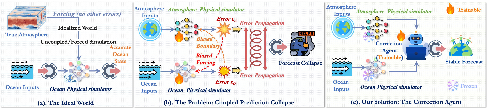
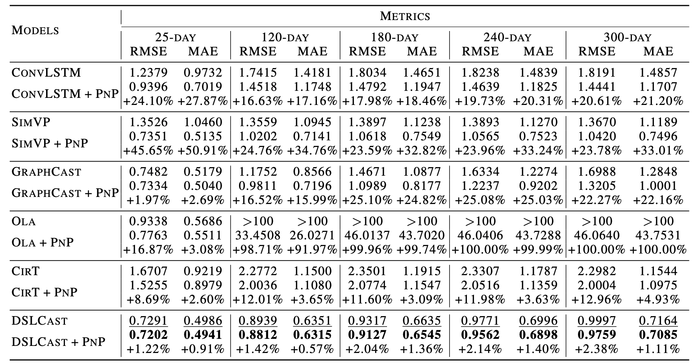
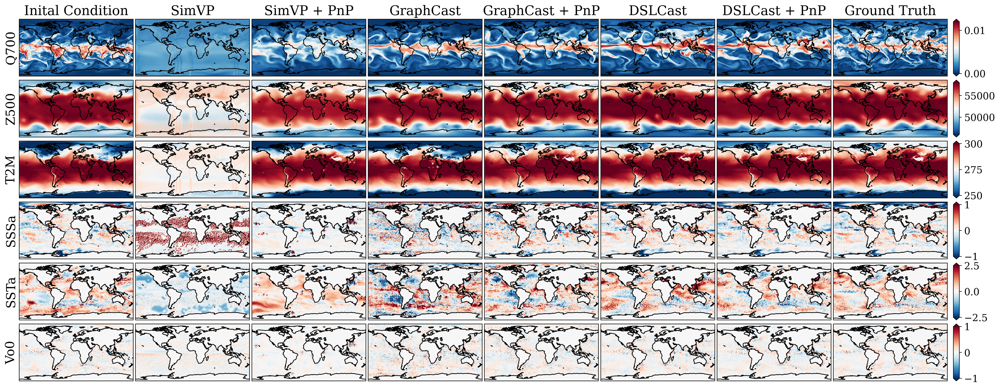

# <p align=center> PnP-Corrector: A Universal Correction Framework for Coupled Spatiotemporal Forecasting</p>

 <div align="center">
 
[](https://arxiv.org/abs/2605.08935)
[](xx)

</div>
<div align=center>

</div>

---

> **Abstract:** *Coupled spatiotemporal forecasting is important for predicting the future evolution of multiple interacting dynamical systems, such as in climate models. However, existing methods are severely constrained by the persistent bottleneck of compounding errors. In coupled systems, errors from each subsystem simulator propagate and amplify one another, a phenomenon we term Reciprocal Error Amplification, leading to a rapid collapse of long-range predictions. To address this challenge, we propose a universal framework called PnP-Corrector (Plug-and-Play Corrector). The core idea of our framework is to decouple the physical simulation from the error correction process: it freezes pre-trained physics simulation engines and exclusively trains a correction agent to proactively counteract the systematic biases emerging from the coupled system. Furthermore, we design an efficient predictive model architecture, DSLCast, to serve as the backbone of this framework. Extensive experiments demonstrate that our method significantly enhances the long-term stability and accuracy of coupled forecasting systems. For instance, in the challenging task of a 300-day global ocean-atmosphere coupled forecast, our PnP-Corrector framework reduces the prediction error of the baseline model by 29% and surpasses state-of-the-art models on several key metrics.*
---

## News 🚀
* **2026.05.14**: Training and inference codes are released.
* **2026.05.09**: Paper is released on [arXiv](https://arxiv.org/abs/2605.08935).
* **2026.05.01**: PnP-Corrector is accepted by [ICML 2026](https://icml.cc/).

## Notes

The intact project is avilable on [Hugging Face](xx), you can find the pretrained models, test data on Hugging Face and put them in the same location.

## Quick Start

### Installation

- cuda 11.8

```
# git clone this repository
git clone https://github.com/Alexander-wu/PnP-Corrector.git
cd PnP-Corrector

# create new anaconda env
conda env create -f environment.yml
conda activate triton_v2
```


### Inference for Coupled Spatiotemporal Forecasting

Preparing the test data as follows:

```
./data/
|--atmos
|  |--test
|  |  |--2020.h5
|  |--mean_only_daily_data_1993_to_2017.npy
|  |--std_only_daily_data_1993_to_2017.npy
|--ocean
|  |--test
|  |  |--2020.h5
|  |--climate_mean_s_t_ssh.npy
|  |--mean_s_t_ssh_coupler.npy
|  |--std_s_t_ssh_coupler.npy
|  |--mean.npy
|  |--std.npy
```

```
cd correction_agent
```


Run the following script:

```
inference.sh
```

### Inference for Coupled Spatiotemporal Forecasting (Expanding Coupling Framework to More Spheres)

Preparing the test data as follows:

```
./data/
|--atmos
|  |--test
|  |  |--2020.h5
|  |--mean_only_daily_data_1993_to_2017.npy
|  |--std_only_daily_data_1993_to_2017.npy
|--ocean
|  |--test
|  |  |--2020.h5
|  |--climate_mean_s_t_ssh.npy
|  |--mean_s_t_ssh_coupler.npy
|  |--std_s_t_ssh_coupler.npy
|  |--mean.npy
|  |--std.npy
|--land
|  |--test
|  |  |--2020.h5
|  |--mean.npy
|  |--std.npy
```

```
cd correction_agent_more_spheres
```


Run the following script:

```
inference.sh
```

   
## Training

**1. Prepare Data**

Preparing the train, valid, and test data as follows:

```
./data/
|--atmos
|  |--train
|  |  |--1993.h5
|  |  |--1994.h5
|  |  |--......
|  |  |--2016.h5
|  |  |--2017.h5
|  |--valid
|  |  |--2018.h5
|  |  |--2019.h5
|  |--test
|  |  |--2020.h5
|  |--mean_only_daily_data_1993_to_2017.npy
|  |--std_only_daily_data_1993_to_2017.npy
|--ocean
|  |--train
|  |  |--1993.h5
|  |  |--1994.h5
|  |  |--......
|  |  |--2016.h5
|  |  |--2017.h5
|  |--valid
|  |  |--2018.h5
|  |  |--2019.h5
|  |--test
|  |  |--2020.h5
|  |--climate_mean_s_t_ssh.npy
|  |--mean_s_t_ssh_coupler.npy
|  |--std_s_t_ssh_coupler.npy
|  |--mean.npy
|  |--std.npy
|--land
|  |--train
|  |  |--1993.h5
|  |  |--1994.h5
|  |  |--......
|  |  |--2016.h5
|  |  |--2017.h5
|  |--valid
|  |  |--2018.h5
|  |  |--2019.h5
|  |--test
|  |  |--2020.h5
|  |--mean.npy
|  |--std.npy
```

For atmos data ranging from 1993 to 2020, each h5 file includes a key named 'fields' with the shape [T, C, H, W] (T=365/366, C=69, H=181, W=360). The order of all variables is as follows:

```
var_idex = {
    "Z50":0, "Z100":1, "Z150":2, "Z200":3, "Z250":4, "Z300":5, "Z400":6, "Z500":7, "Z600":8, "Z700":9, "Z850":10, "Z925":11, "Z1000":12,
    "Q50":13, "Q100":14, "Q150":15, "Q200":16, "Q250":17, "Q300":18, "Q400":19, "Q500":20, "Q600":21, "Q700":22, "Q850":23, "Q925":24, "Q1000":25,
    "T50":26, "T100":27, "T150":28, "T200":29, "T250":30, "T300":31, "T400":32, "T500":33, "T600":34, "T700":35, "T850":36, "T925":37, "T1000":38,
    "U50":39, "U100":40, "U150":41, "U200":42, "U250":43, "U300":44, "U400":45, "U500":46, "U600":47, "U700":48, "U850":49, "U925":50, "U1000":51,
    "V50":52, "V100":53, "V150":54, "V200":55, "V250":56, "V300":57, "V400":58, "V500":59, "V600":60, "V700":61, "V850":62, "V925":63, "V1000":64,
    "U10M":65, "V10M":66, "T2M":67, "MSLP":68,
   
}
```
Regarding the meaning of abbreviated variables, for example, "Z50" means Geopotential at 50 hPa.

For ocean data ranging from 1993 to 2020, each h5 file includes a key named 'fields' with the shape [T, C, H, W] (T=365/366, C=97, H=181, W=360). The order of all variables is as follows:

```
var_idex = {
    "SSS": 0, "S2": 1, "S5": 2, "S7": 3, "S11": 4, "S15": 5, "S21": 6, "S29": 7, "S40": 8, "S55": 9, "S77": 10, "S92": 11, "S109": 12,
    "S130": 13, "S155": 14, "S186": 15, "S222": 16, "S266": 17, "S318": 18, "S380": 19, "S453": 20, "S541": 21, "S643": 22,
    "U0": 23, "U2": 24, "U5": 25, "U7": 26, "U11": 27, "U15": 28, "U21": 29, "U29": 30, "U40": 31, "U55": 32, "U77": 33, "U92": 34, "U109": 35,
    "U130": 36, "U155": 37, "U186": 38, "U222": 39, "U266": 40, "U318": 41, "U380": 42, "U453": 43, "U541": 44, "U643": 45,
    "V0": 46, "V2": 47, "V5": 48, "V7": 49, "V11": 50, "V15": 51, "V21": 52, "V29": 53, "V40": 54, "V55": 55, "V77": 56, "V92": 57, "V109": 58,
    "V130": 59, "V155": 60, "V186": 61, "V222": 62, "V266": 63, "V318": 64, "V380": 65, "V453": 66, "V541": 67, "V643": 68,
    "SST": 69, "T2": 70, "T5": 71, "T7": 72, "T11": 73, "T15": 74, "T21": 75, "T29": 76, "T40": 77, "T55": 78, "T77": 79, "T92": 80, "T109": 81,
    "T130": 82, "T155": 83, "T186": 84, "T222": 85, "T266": 86, "T318": 87, "T380": 88, "T453": 89, "T541": 90, "T643": 91,
    "SSH": 92,
   
}
```
Regarding the meaning of abbreviated variables, for example, "SSS" means sea surface salinity and "S2" means salinity at depth 2 m.

For land data ranging from 1993 to 2020, each h5 file includes a key named 'fields' with the shape [T, C, H, W] (T=365/366, C=4, H=181, W=360). The order of all variables is as follows:

```
var_idex = {
    "stl1": 0, "stl2": 1, "stl3": 2, "stl4": 3,
  
}
```
Regarding the meaning of abbreviated variables, for example, "stl1" means Soil Temperature at depth level 1.


**2. Multi-node Multi-GPU Training**

- **Training for the atmos engine**

```
cd atmos_engine
```

```
sh train.sh
```

- **Training for the ocean engine**

```
cd ocean_engine
```

```
sh train.sh
```

- **Training for the land engine**

```
cd land_engine
```

```
sh train.sh
```

- **Training for the correction agent**

```
cd correction_agent
```

```
sh train.sh
```

- **Training for the correction agent (expanding coupling framework to more spheres)**

```
cd correction_agent_more_spheres
```

```
sh train.sh
```


## Performance
### Global Coupled Atmosphere-Ocean Forecasting

</div>
<div align=center>

</div>


</div>
<div align=center>

</div>

Continue Update

## Citation

```
@article{wu2026pnp,
  title={PnP-Corrector: A Universal Correction Framework for Coupled Spatiotemporal Forecasting},
  author={Wu, Hao and Xu, Fan and Lu, Yuxu and Zhao, Penghao and Zhang, Fan and Jia, Hao and Liang, Yuxuan and Gou, Ruijian and Wen, Qingsong and Wu, Xian and others},
  journal={arXiv preprint arXiv:2605.08935},
  year={2026}
}
```

## Acknowledgement

We appreciate the following open-sourced repositories for their valuable code base:

[https://github.com/NVlabs/FourCastNet](https://github.com/NVlabs/FourCastNet)

[https://github.com/NVIDIA/physicsnemo](https://github.com/NVIDIA/physicsnemo)
